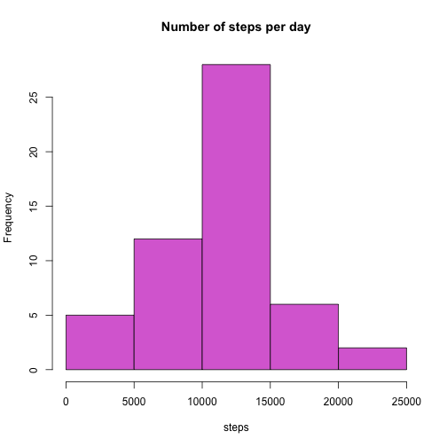
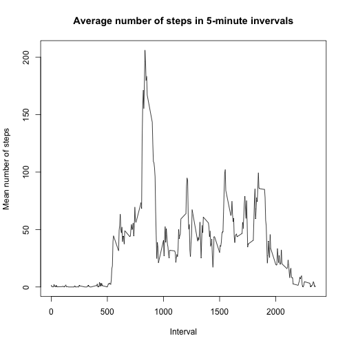
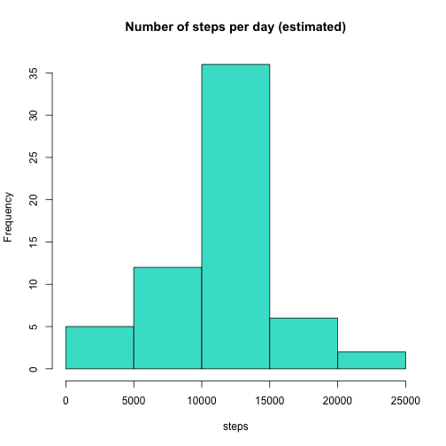

##Loading and preprocessing data

1. unzip file, read csv


```r
unzip("activity.zip")
activity <- read.csv("activity.csv", header = TRUE, stringsAsFactors = FALSE)
```

2. reformat date as Date object


```r
activity$date <- as.POSIXct(activity$date, format = "%Y-%m-%d")
```

##What is mean total number of steps taken per day?

remove NAs


```r
activity1 <- activity[complete.cases(activity), ]
```

1. histogram of the total number of steps taken each day


```r
library(reshape2)
actMelt <- melt(activity1, id = c("date", "interval"), measure.vars = "steps")
sumSteps <- dcast(actMelt, date ~ variable, sum)
hist(sumSteps$steps,
     main = "Number of steps per day",
     xlab = "steps",
     col = "orchid"
     )
```

 

2a. mean number of steps per day


```r
mean(sumSteps$steps)
```

```
## [1] 10766.19
```

2b. median number of steps per day


```r
median(sumSteps$steps)
```

```
## [1] 10765
```

##What is the average daily activity pattern?

1. Average the number of steps in each 5-minute interval over all days.  
Graph as a time series


```r
library(reshape2)
actMelt <- melt(activity, id = c("date", "interval"), measure.vars = "steps")
meanInterval <- dcast(actMelt, interval ~ variable, mean, na.rm = TRUE)
plot(meanInterval$interval, meanInterval$steps,
     type = "l",
     main = "Average number of steps in 5-minute invervals",
     xlab = "Interval",
     ylab = "Mean number of steps"
     )
```

 

2. Which 5-minute inverval, averaged across all days in the dataset, contains the maximum number of steps?


```r
sorted <- meanInterval[order(-meanInterval$steps), ]
print(sorted[1,1])
```

```
## [1] 835
```

##Imputing missing values

1. Calculate the number of missing values in the dataset


```r
#activity1 is the complete.cases dataset from "remove NAs"" code chunk above
nrow(activity)-nrow(activity1)
```

```
## [1] 2304
```

2/3. Fills in any NA values with the average number of steps for that interval, averaged across all days


```r
#uses above meanInterval df that provides average steps over all days for each time interval
na_steps <- which(is.na(activity$steps))
na_interval <- activity$interval[na_steps]
activity$steps[na_steps] <- meanInterval$steps[match(na_interval, meanInterval$interval)]
```

all NAs in activity df have now been replaced with average values based on the time interval

4. histogram of total steps with missing data estimated


```r
library(reshape2)
actMelt <- melt(activity, id = c("date", "interval"), measure.vars = "steps")
sumStepsEst <- dcast(actMelt, date ~ variable, sum)
hist(sumStepsEst$steps,
     main = "Number of steps per day (estimated)",
     xlab = "steps",
     col = "turquoise"
     )
```

 

estimated mean number of steps per day


```r
mean(sumStepsEst$steps)
```

```
## [1] 10766.19
```

estimated median number of steps per day


```r
median(sumStepsEst$steps)
```

```
## [1] 10766.19
```

The mean total number of steps taken per day is exactly the same between the dataset that contains NAs and the one with NAs replaced by the mean number of steps for that interval averaged across all days.  There is a slight difference with the median, reflecting  the added values.  It looks like this method for imputing missing values maintains the mean for the overall dataset, but it increases the median values by a small amount.  

##Are there differences in activity patterns between weekdays and weekends?

1. adding a factor variable that indicates whether each day is a weekend or weekday


```r
days <- weekdays(activity$date)
activity_week <- cbind(activity, days)

#add "weekday" variable for weekdays
weekdays_df <- activity_week[activity_week$days %in% c("Monday", "Tuesday", "Wednesday", "Thursday", "Friday") , ]
weekdays_df2 <- cbind(weekdays_df, "weekday")
names(weekdays_df2) <- c("steps", "date", "interval", "day", "weekday.or.end")

#add "weekend" variable for weekend days
weekend_df <- activity_week[activity_week$days %in% c("Saturday", "Sunday") , ]
weekend_df2 <- cbind(weekend_df, "weekend")
names(weekend_df2) <- c("steps", "date", "interval", "day", "weekday.or.end")

#compile full dataset that contains "weekend" and "weekday" indications
weekday_end <- rbind(weekdays_df2, weekend_df2)
```

2. time series plot that shows average number of steps taken in 5 minute intervals during weedays vs. weekends


```r
library(reshape2)
weekMelt <- melt(weekday_end, id = c("date", "interval", "day", "weekday.or.end"), measure.vars = "steps")
weekDcast <- dcast(weekMelt, weekday.or.end + interval ~ variable, mean)

library(lattice)
attach(weekDcast)
```

```
## The following objects are masked from weekDcast (pos = 3):
## 
##     interval, steps, weekday.or.end
## 
## The following objects are masked from weekDcast (pos = 5):
## 
##     interval, steps, weekday.or.end
```

```r
xyplot(steps ~ interval|weekday.or.end,
       type = "l",
       layout = c(1,2),
       xlab = "Interval",
       ylab = "Number of steps"
       )
```

 
